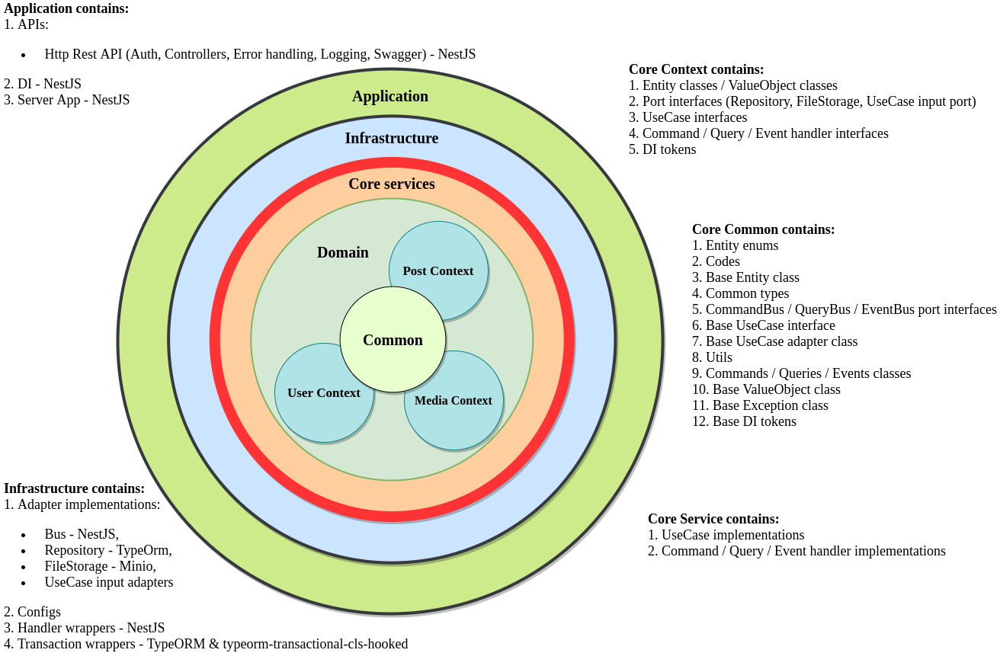
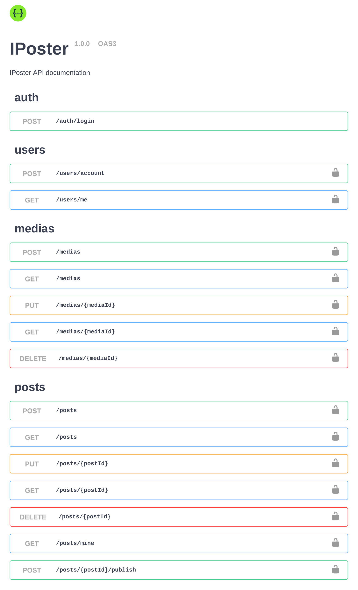

# 🚀 Backend - Production-Ready Architecture

[](./LICENSE)

[]()

> Hệ thống backend với Clean Architecture, NestJS, và production-ready features như Airbnb, Netflix.

<p align="center"> 
    
</p>

---

## 🎯 ĐẶC ĐIỂM NỔI BẬT

### ✅ Production-Ready Features
- 🔐 **Security**: Rate limiting, Helmet, CORS, Input validation
- 🏥 **Health Checks**: Liveness, readiness, and detailed health endpoints
- 📝 **Structured Logging**: JSON format cho ELK/Loki integration
- 💾 **Caching**: Redis-based caching strategy
- 📊 **Metrics**: Prometheus-compatible metrics endpoint
- 🚀 **CI/CD**: Automated pipeline với GitHub Actions
- ☸️ **Kubernetes**: Production-ready K8s manifests
- 📦 **Docker**: Multi-stage optimized Dockerfile
- 📚 **Documentation**: Comprehensive guides và runbooks

### 🏗️ Architecture
- **Clean Architecture**: Separation of concerns
- **CQRS Pattern**: Command Query Responsibility Segregation
- **Domain-Driven Design**: Rich domain models
- **Dependency Injection**: NestJS DI container
- **TypeScript**: Type-safe codebase

---

## 📚 TÀI LIỆU QUAN TRỌNG

| Document | Mô tả | Khi nào đọc |
|----------|-------|-------------|
| **[QUICK_START.md](./QUICK_START.md)** | Hướng dẫn bắt đầu nhanh | ⭐ ĐỌC ĐẦU TIÊN |
| **[PRODUCTION_ASSESSMENT.md](./PRODUCTION_ASSESSMENT.md)** | Đánh giá toàn diện hệ thống | Để hiểu tổng quan |
| **[IMPROVEMENTS_SUMMARY.md](./IMPROVEMENTS_SUMMARY.md)** | Tóm tắt cải tiến | Xem những gì đã thay đổi |
| **[DEPLOYMENT_GUIDE.md](./DEPLOYMENT_GUIDE.md)** | Hướng dẫn deploy chi tiết | Khi deploy |
| **[RUNBOOK.md](./RUNBOOK.md)** | Xử lý sự cố và vận hành | Khi có incident |

---

## 🚀 QUICK START

### 1. Cài đặt
```bash
# Clone repository
git clone <repository-url>
cd backend

# Install dependencies
npm install

# Copy environment file
cp env/local.env .env
```

### 2. Chạy Local Development
```bash
# Start dependencies (PostgreSQL, Redis, MongoDB, MinIO)
docker-compose up -d

# Run in development mode
npm run dev

# Application sẽ chạy tại http://localhost:3005
```

### 3. Test
```bash
# Run tests
npm test

# Run tests with coverage
npm run test:cov

# Lint
npm run lint
```

### 4. Build & Deploy
```bash
# Build for production
npm run build

# Start production
npm start

# Hoặc build Docker image
docker build -f Dockerfile.production -t backend:latest .
```

---

## 🏗️ PROJECT STRUCTURE

```
backend/
├── src/
│   ├── application/          # Application layer
│   │   ├── api/
│   │   │   └── http-rest/   # REST API controllers
│   │   │       ├── controller/
│   │   │       ├── guard/
│   │   │       ├── middleware/
│   │   │       ├── interceptor/
│   │   │       ├── pipe/
│   │   │       └── dto/
│   │   └── di/              # Dependency injection modules
│   ├── core/                # Core business logic
│   │   ├── domain/          # Domain entities & value objects
│   │   ├── service/         # Use cases & business logic
│   │   └── common/          # Shared utilities
│   └── infrastructure/      # Infrastructure layer
│       ├── adapter/         # External adapters
│       │   ├── persistence/ # Database (TypeORM)
│       │   ├── cache/       # Caching (Redis)
│       │   ├── logger/      # Logging
│       │   ├── message/     # Message queue (BullMQ)
│       │   └── monitoring/  # Metrics
│       └── config/          # Configuration
├── k8s/                     # Kubernetes manifests
├── .github/workflows/       # CI/CD pipelines
├── env/                     # Environment files
└── docs/                    # Documentation

**Kiến trúc**: Clean Architecture với 3 layers
- **Application**: HTTP handlers, controllers
- **Core**: Business logic, domain models
- **Infrastructure**: Technical implementations
```

---

## 🔌 API ENDPOINTS

### Health & Monitoring
```bash
GET /health              # Detailed health info
GET /health/live         # Liveness probe
GET /health/ready        # Readiness probe
GET /metrics             # Prometheus metrics
GET /documentation       # Swagger API docs
```

### Authentication
```bash
POST /api/auth/login     # User login
POST /api/auth/register  # User registration
POST /api/auth/refresh   # Refresh token
```

### Users
```bash
GET    /api/users        # List users (paginated)
GET    /api/users/:id    # Get user
PUT    /api/users/:id    # Update user
DELETE /api/users/:id    # Delete user
```

### Posts
```bash
GET    /api/posts        # List posts (paginated)
GET    /api/posts/:id    # Get post
POST   /api/posts        # Create post
PUT    /api/posts/:id    # Update post
DELETE /api/posts/:id    # Delete post
POST   /api/posts/:id/publish  # Publish post
```

### Media
```bash
GET    /api/media        # List media (paginated)
GET    /api/media/:id    # Get media
POST   /api/media        # Upload media
DELETE /api/media/:id    # Delete media
```

**Full API Documentation**: http://localhost:3005/documentation

---

## 🔐 SECURITY FEATURES

### Implemented
- ✅ **Rate Limiting**: 100 requests per minute per IP
- ✅ **Helmet**: Security headers protection
- ✅ **CORS**: Configurable cross-origin policy
- ✅ **Input Validation**: Class-validator với custom pipes
- ✅ **JWT Authentication**: Access & refresh tokens
- ✅ **Role-Based Access Control**: Author, Guest roles
- ✅ **SQL Injection Protection**: TypeORM parameterized queries
- ✅ **XSS Protection**: Input sanitization
- ✅ **HTTPS Enforcement**: Production mode

### Environment Variables (Security)
```bash
# CRITICAL: Không commit secrets vào git
API_ACCESS_TOKEN_SECRET=<generate-strong-secret>
API_REFRESH_TOKEN_SECRET=<generate-strong-secret>
DB_PASSWORD=<strong-password>
REDIS_PASSWORD=<strong-password>

# Production: Sử dụng secrets manager
# AWS Secrets Manager, HashiCorp Vault, etc.
```

---

## 📊 MONITORING & OBSERVABILITY

### Built-in Features
- ✅ **Health Checks**: Liveness & readiness probes
- ✅ **Metrics**: Prometheus-compatible metrics
- ✅ **Structured Logging**: JSON format logs
- ✅ **Request Tracing**: Request ID tracking
- ✅ **Audit Logging**: MongoDB + PostgreSQL audit trail

### Integration Ready
- **APM**: DataDog, New Relic, Elastic APM
- **Logging**: ELK Stack, Loki, CloudWatch
- **Metrics**: Prometheus + Grafana
- **Alerting**: PagerDuty, OpsGenie

### Metrics Exposed
```bash
# Example metrics at /metrics
http_requests_total{method="GET",path="/api/users",status="200"} 1234
http_request_duration_ms{method="GET",path="/api/users"} 45.2
db_queries_total{success="true"} 5678
cache_access_total{hit="true"} 890
```

---

## 🚀 DEPLOYMENT OPTIONS

### Option 1: Docker Compose
```bash
docker-compose up -d
```

### Option 2: Kubernetes
```bash
kubectl apply -f k8s/
```

### Option 3: AWS ECS/EKS
Chi tiết trong [DEPLOYMENT_GUIDE.md](./DEPLOYMENT_GUIDE.md)

---

## ⚙️ CONFIGURATION

### Environment Variables

#### Application
```bash
NODE_ENV=production|development
API_HOST=0.0.0.0
API_PORT=3005
API_LOG_ENABLE=true
```

#### Security
```bash
RATE_LIMIT_TTL=60              # seconds
RATE_LIMIT_MAX=100             # requests
ALLOWED_ORIGINS=https://yourdomain.com
```

#### Database
```bash
DB_HOST=localhost
DB_PORT=5432
DB_USERNAME=user
DB_PASSWORD=password
DB_NAME=database
DB_POOL_SIZE=20
```

#### Redis
```bash
REDIS_URL=redis://localhost:6379
CACHE_TTL=3600                 # seconds
```

Xem `env/production.env.example` cho danh sách đầy đủ.

---

## 🧪 TESTING

```bash
# Unit tests
npm test

# E2E tests
npm run test:e2e

# Coverage
npm run test:cov

# Watch mode
npm run test:watch
```

### Test Structure
```
test/
├── unit/           # Unit tests
├── integration/    # Integration tests
└── e2e/           # End-to-end tests
```

---

## 📦 DEPENDENCIES

### Main Dependencies
- **NestJS** - Progressive Node.js framework
- **TypeORM** - ORM for TypeScript
- **PostgreSQL** - Primary database
- **Redis** - Caching & message queue
- **MongoDB** - Audit logs
- **BullMQ** - Job queue
- **Passport** - Authentication
- **Helmet** - Security headers
- **Class Validator** - Input validation

### New Production Dependencies
- **@nestjs/throttler** - Rate limiting
- **helmet** - Security headers
- **compression** - Response compression

---

## 🔄 CI/CD PIPELINE

### GitHub Actions Workflow
```yaml
1. Lint & Format Check
2. Build Application
3. Unit Tests
4. Security Audit
5. Docker Build & Push
6. Deploy (on main branch)
```

### Pipeline Triggers
- **Push to main**: Full deployment
- **Push to develop**: Build & test only
- **Pull Request**: Lint, test, build

---

## 🐛 TROUBLESHOOTING

### Common Issues

#### Application won't start
```bash
# Check logs
docker logs backend
kubectl logs <pod-name>

# Check environment variables
env | grep API_
```

#### Database connection failed
```bash
# Test connection
psql -h $DB_HOST -U $DB_USERNAME -d $DB_NAME

# Check credentials
```

#### Redis connection failed
```bash
# Test connection
redis-cli -h $REDIS_HOST ping
```

**Xem [RUNBOOK.md](./RUNBOOK.md) cho troubleshooting chi tiết**

---

## 📖 USE CASES

### IPoster Application

#### Main Entities
1. **User** - Authors and Guests
2. **Post** - User-created content
3. **Media** - Images and files
4. **Album** - Media collections
5. **Comment** - Post comments

#### User Flows
- User registration & authentication
- Create and publish posts
- Upload and manage media
- Comment on posts
- Create albums

**Chi tiết**: Xem API documentation tại `/documentation`

---

## 🤝 CONTRIBUTING

1. Fork the repository
2. Create feature branch: `git checkout -b feature/amazing-feature`
3. Commit changes: `git commit -m 'feat: add amazing feature'`
4. Push to branch: `git push origin feature/amazing-feature`
5. Open Pull Request

### Commit Convention
Sử dụng [Conventional Commits](https://www.conventionalcommits.org/):
- `feat:` - New feature
- `fix:` - Bug fix
- `docs:` - Documentation
- `refactor:` - Code refactoring
- `test:` - Tests
- `chore:` - Maintenance

---

## 📄 LICENSE

MIT License - see [LICENSE](./LICENSE) file for details

---

## 👥 SUPPORT

### Documentation
- **Quick Start**: [QUICK_START.md](./QUICK_START.md)
- **Deployment**: [DEPLOYMENT_GUIDE.md](./DEPLOYMENT_GUIDE.md)
- **Troubleshooting**: [RUNBOOK.md](./RUNBOOK.md)

### Resources
- [NestJS Documentation](https://docs.nestjs.com/)
- [TypeORM Documentation](https://typeorm.io/)
- [Clean Architecture](https://blog.cleancoder.com/uncle-bob/2012/08/13/the-clean-architecture.html)

---

## 🎓 ADDITIONAL RESOURCES

### Learn More
- **Clean Architecture**: [Original README](./README.original.md)
- **Project Assessment**: [PRODUCTION_ASSESSMENT.md](./PRODUCTION_ASSESSMENT.md)
- **Improvements**: [IMPROVEMENTS_SUMMARY.md](./IMPROVEMENTS_SUMMARY.md)

### Best Practices
- **Security**: OWASP Top 10
- **Performance**: Web Performance Best Practices
- **DevOps**: The Twelve-Factor App
- **Monitoring**: Google SRE Book

---

## ⭐ QUICK LINKS

| Link | Description |
|------|-------------|
| [Get Started](./QUICK_START.md) | Bắt đầu ngay |
| [Deploy](./DEPLOYMENT_GUIDE.md) | Hướng dẫn deploy |
| [Troubleshoot](./RUNBOOK.md) | Giải quyết vấn đề |
| [API Docs](http://localhost:3005/documentation) | API documentation |

---

**Status**: ✅ **PRODUCTION-READY**

**Last Updated**: October 8, 2025

**Version**: 1.0.0
  
## Local Development

* **Docker**

    All necessary external services are described in the [./docker-compose.yaml](./docker-compose.yaml):
    * Run `docker-compose -f docker-compose.yaml up -d`
    * Stop `docker-compose -f docker-compose.yaml stop`
    
    Services:
    1. PostgreSQL - [Credentials](./env/local.pg.env).
    2. Minio - [Credentials](./env/local.minio.env).
    
* **Building**

    1. Install libraries - `npm install`
    2. Build application - `npm run build`
    
* **Configuring**
  
    Configuring is based on the environment variables. All environment variables must be exposed before starting the application.
    See [all environment variables](./env/local.app.env).
    
* **Running**

    * Start application - `npm run start`
    * Expose [./env/local.app.env](./env/local.app.env) and start application - `npm run start:local`
    
      <details>
        <summary>
          API documentation will be available on the endpoint <i>GET <a href="http://localhost:3005/documentation/" target="_blank" rel="noopener noreferrer">http://localhost:3005/documentation</a></i>
        </summary>
        <br>
        
        <p align="center"> 
            
        </p>
      </details>
    
* **Linting**

    * `npm run lint`
    
* **Testing**

    * Prepare environment - `docker-compose -f docker-compose.test.yaml up -d`
    * Run tests - `npm run test`
    * Run tests with coverage - `npm run test:cov`
     
* **Libraries checking**    
   
    * Show new libraries' versions - `npm run lib:check`
    * Upgrade libraries' versions - `npm run lib:upgrade`
    
* **IDE**

    * IntelliJ IDEA:
      1. [Launch Configuration](./asset/IdeaRunConfiguration.png)
      2. [Test Configuration](./asset/IdeaTestConfiguration.png)
      
    * Visual Studio Code:
      1. [Launch Configuration](./.vscode/launch.json)
      2. [Test Configuration](./.vscode/settings.json)
